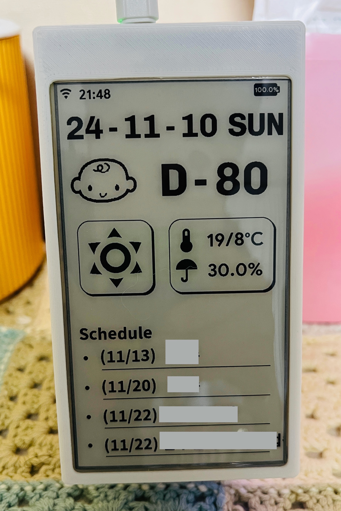
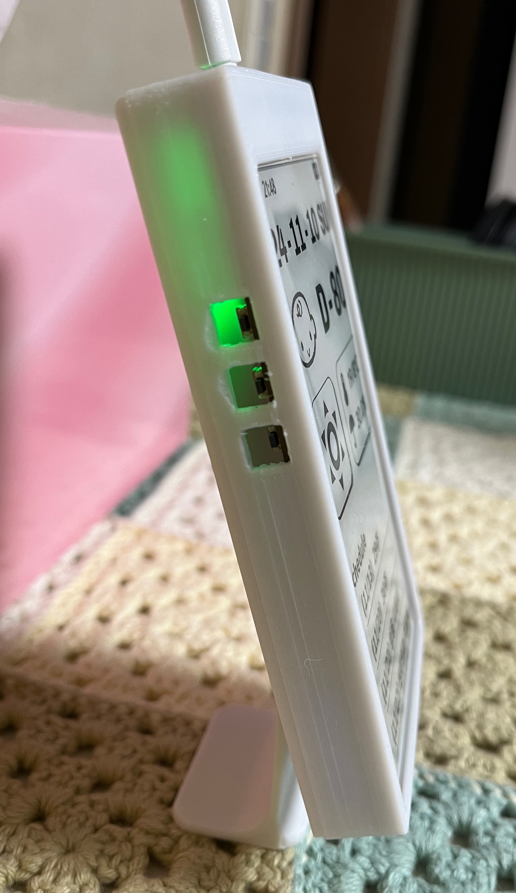

# E-Ink Dashboard 프로젝트

(Korean Ver.)

## 프로젝트 소개

이 프로젝트는 라즈베리파이에 설치된 Home Assistant의 센서 데이터를 ESP32 보드와 연결된 E-Ink 디스플레이에 출력하는 대시보드를 제작하는 과정입니다. **라즈베리파이**, **ESP32**, 그리고 **E-Ink 디스플레이**를 활용하여 스마트 홈의 정보를 실시간으로 확인할 수 있는 사용자 친화적인 대시보드를 구현합니다.

### 시작 배경

이 프로젝트의 아이디어는 아래 유튜브 영상에서 영감을 받았습니다:  
[YouTube: The E-ink Desk Accessory I've Always Wanted](https://youtu.be/d9forDotXkI?si=2RHDaCQY3nmeGRLc)

이 영상을 보고 직접 비슷한 시스템을 구축해 보고 싶어 프로젝트를 시작하게 되었습니다.

하지만 스마트홈이나 마이크로프로세서 등에 대한 기초 지식이 거의 없었기 때문에, 혼자 이 프로젝트를 진행하는 것은 무리가 있었습니다.

그래서 기본적인 구성은 프로젝트의 영감을 준 유튜브와 GitHub 페이지를 적극 참고하였고,  
Home Assistant 를 기반으로 하는 스마트홈 시스템 구축과 셋팅은 구글링 서치를,  
마지막으로 ESP32 보드의 구동을 위한 코드 작성은 GitHub 과 ChatGPT 를 활용하였습니다.  
[GitHub : davidz-yt/eink-desk-display](https://github.com/davidz-yt/eink-desk-display)

---

## 시스템 구성

### 주요 구성

1. **Home Assistant**:  
   라즈베리파이에 설치되어 스마트 홈의 센서 데이터를 관리합니다. (일정, 일기예보 등)
   
2. **ESP32 보드와 E-Ink 디스플레이**:  
   Home Assistant 로부터 데이터를 받아 디스플레이에 출력합니다.

3. **통신 방식**:  
   ESP32 보드는 Wi-Fi를 통해 Home Assistant와 통신하며, E-Ink 디스플레이에 데이터를 표시합니다.

### 사용한 부품

#### 1. 라즈베리파이  
- **라즈베리파이 5 (4GB)**  
  [공식 구매 링크](https://www.raspberrypi.com/products/raspberry-pi-5/)  
- **정품 케이스**
- **5V/5A 전용 전원 어댑터** (안정적인 전원 공급을 위해 필수)

#### 2. ESP32 보드 & E-Ink 디스플레이  
- **LilyGO T5 4.7-Inch E-Paper (V2.3)**  
  [공식 제품 링크](https://lilygo.cc/products/t5-4-7-inch-e-paper-v2-3)

#### 3. 기타 부품 및 도구
- microSD 카드 (라즈베리파이 OS 설치용)
- 전원 어댑터 (라즈베리파이와 ESP32용)
- USB 케이블 (ESP32 설정용)
- Wi-Fi 네트워크

---

## 설치 및 설정 가이드

### 1단계: 라즈베리파이에 Home Assistant 설치 및 셋업  
라즈베리파이에 Home Assistant를 설치하고 기본적인 셋업을 완료합니다.  
아래 블로그의 가이드를 참고하여 설치를 진행했습니다.:  
[라즈베리파이 Home Assistant OS 설치하기](https://yogyui.tistory.com/entry/라즈베리파이-Home-Assistant-OS-설치하기)

#### 추가로 설치할 Add on
- ESP Home (2단계에서 추가 설명)
- File editor
- Terminal & SSH

#### 추가로 설치할 통합구성요소 (Integration)
- HACS (Home Assistant Community Store) (아래의 구성요소 설치 편의성을 위해 먼저 설치 권장)
- WeatherNews (일기예보 센서)
- iCal Sensor (Google Calendar 의 일정을 받아오기 위한 센서)

---

### 2단계: ESP Home 설치 및 설정  

1. **ESPHome 설치**  
E-Ink 디스플레이는 ESP32 보드를 통해 정보를 표시하기 때문에, ESPHome 를 통해 코드 작성이 필요합니다.  
Home Assistant 의 Add on 항목에서 ESPHome을 검색하여 설치합니다.
ESPHome 설치 방법은 아래의 블로그를 참고하였습니다.:  
[Home Assistant - ESPHome 연동](https://kwonkyo.tistory.com/437#gsc.tab=0)

2. **E-Ink 디스플레이 연결**  
E-Ink 디스플레이를 USB 케이블로 연결하고, ESPHome 상에서 새로운 장치를 추가하여 셋팅을 시작합니다.
초기 셋팅 시에는 WiFi 를 잡을 수 없으므로 (Plug into this computer) 를 선택하여 유선으로 셋팅해야 합니다.  
정상적으로 장치가 추가되었다면 Home Assistant 설정 → 기기 및 서비스 → 통합구성요소 → ESPHome 내에 1개의 기기가 추가되어 있을 것 입니다.  
추가된 기기를 선택한 후 구성 → (Allow the device to perform Home Assistant actions.) 항목에 체크를 해주세요.  
여기까지 했다면 기본적으로 E-Ink 디스플레이를 사용할 준비는 되었습니다.

---

### 3단계: 코드 작성  

ESP32 보드가 WiFi 를 통해 ESPHome 에 연결되면 Home Assistant로부터 데이터를 가져와 E-Ink 디스플레이에 표시합니다.  
    
다음 정보를 화면에 표시하도록 설정되었습니다:
- WiFi 연결, 배터리 상태
- 디스플레이 업데이트 시간 : 매일 새벽 5시에 한번 업데이트
- D-day 계산 : 곧 태어날 아기의 출산 예정일 (화면 업데이트 시 마다 아기 얼굴이 랜덤하게 바뀜) 
- 현재 날씨와 온도/강수확률
- 4일간의 향후 일정 : 구글 캘린더와 연동

데모 구동 화면

---
### 4단계: 케이스 제작

완성된 대시보드의 케이스를 제작하기 위해 보드 제작사의 모델링 파일과 GitHub 에 공개된 모델링 파일을 참고하여 약간의 수정을 하였습니다.  
[보드 제작사 - 케이스 모델링](https://github.com/Xinyuan-LilyGO/LilyGo-EPD47/tree/esp32s3/shell/style3)  
[GitHub : davidz-yt/eink-desk-display](https://github.com/davidz-yt/eink-desk-display/tree/main/3DModel)

완성된 모델링 파일은 아래의 3D 프린팅 업체를 통해 케이스로 제작하였습니다. (방식 : PLA, 재질 : PETG)  
[3D 프린팅 대행 : 메이드올](https://madeall3d.com/page)  
최종적으로는 버튼 부분에 간섭이 있어서 버튼은 제거하였습니다.  

   

&nbsp;
---
&nbsp;

---

# E-Ink Dashboard Project

(English Ver.)

## Project Introduction

This project is about creating a dashboard that displays sensor data from Home Assistant on an E-Ink display connected to an ESP32 board. Using **Raspberry Pi**, **ESP32**, and an **E-Ink Display**, you can create a user-friendly dashboard to monitor your smart home information in real time.

### Background of the Project

The idea for this project was inspired by the following YouTube video:  
[YouTube: The E-ink Desk Accessory I've Always Wanted](https://youtu.be/d9forDotXkI?si=2RHDaCQY3nmeGRLc)

After watching the video, I decided to build a similar system myself.

As I had limited knowledge of smart homes and microprocessors, completing this project was challenging.  
I relied on the video and GitHub repository for the core configuration,  
Googled extensively for Home Assistant setup,  
and used GitHub and ChatGPT for writing the ESP32 board code.  
[GitHub : davidz-yt/eink-desk-display](https://github.com/davidz-yt/eink-desk-display)

---

## System Overview

### Main Operating System

1. **Home Assistant**:  
   Installed on a Raspberry Pi, it manages smart home sensor data (e.g., schedules, weather forecasts).
   
2. **ESP32 Board and E-Ink Display**:  
   Retrieves data from Home Assistant and displays it on the E-Ink display.

3. **Communication**:  
   The ESP32 board communicates with Home Assistant over Wi-Fi and displays the data on the E-Ink screen.

### Components Used

#### 1. Raspberry Pi  
- **Raspberry Pi 5 (4GB)**  
  [Official Purchase Link](https://www.raspberrypi.com/products/raspberry-pi-5/)  
- **Official Case**
- **5V/5A Power Adapter** (Recommended for stable power supply)

#### 2. ESP32 Board & E-Ink Display  
- **LilyGO T5 4.7-Inch E-Paper (V2.3)**  
  [Official Product Link](https://lilygo.cc/products/t5-4-7-inch-e-paper-v2-3)

#### 3. Other Components and Tools
- microSD Card (For Raspberry Pi OS installation)
- Power Adapter (For Raspberry Pi and ESP32)
- USB Cable (For ESP32 setup)
- Wi-Fi Network

---

## Installation and Setup Guide

### Step 1: Install and Set Up Home Assistant on Raspberry Pi  
Install Home Assistant on your Raspberry Pi and complete the initial setup.  
I referred to the following blog guide for installation:  
[Installing Home Assistant OS on Raspberry Pi](https://yogyui.tistory.com/entry/라즈베리파이-Home-Assistant-OS-설치하기)

#### Additional Add-ons to Install
- ESPHome (Explained in Step 2)
- File Editor
- Terminal & SSH

#### Additional Integrations to Install
- HACS (Home Assistant Community Store) (Recommended for easier installation of other components)
- WeatherNews (Weather forecast sensor)
- iCal Sensor (For Google Calendar sensor)

---

### Step 2: Install and Configure ESPHome  

1. **Install ESPHome**  
Since the E-Ink display requires the ESP32 board for operation, ESPHome is used for coding.  
Install ESPHome via the Add-on store in Home Assistant.  
Refer to this blog for installation details:  
[Home Assistant - ESPHome Integration](https://kwonkyo.tistory.com/437#gsc.tab=0)

2. **Connect the E-Ink Display**  
Connect the E-Ink display via a USB cable and add a new device in ESPHome.  
During initial setup, choose "Plug into this computer" for a wired configuration.  
Once added, verify the device in Home Assistant under Settings → Devices & Services → Integrations → ESPHome.  
Select the device, click Configure, and enable the "Allow the device to perform Home Assistant actions" option.

---

### Step 3: Write Code  

When the ESP32 board connects to ESPHome via Wi-Fi, it retrieves data from Home Assistant to display on the E-Ink screen.  
   
The display is configured to show the following information:
- Wi-Fi connection and battery status
- Display update time: Updates once daily at 5 AM
- D-day countdown: Tracks the due date of an upcoming baby (with randomized baby faces)
- Current weather and temperature/precipitation probability
- Upcoming schedule for 4 days: Synced with Google Calendar

 

Demo Screen

---

### Step 4: Create a Case

To house the completed dashboard, I customized 3D modeling files provided by the board manufacturer and GitHub contributors.  
[Case Modeling by Board Manufacturer](https://github.com/Xinyuan-LilyGO/LilyGo-EPD47/tree/esp32s3/shell/style3)  
[GitHub : davidz-yt/eink-desk-display](https://github.com/davidz-yt/eink-desk-display/tree/main/3DModel)

The case was printed by a 3D printing service (Material: PETG, Method: PLA).  
[3D Printing Service: MadeAll](https://madeall3d.com/page)  
Final adjustments were made to remove the buttons due to interference.

 

&nbsp;
---
